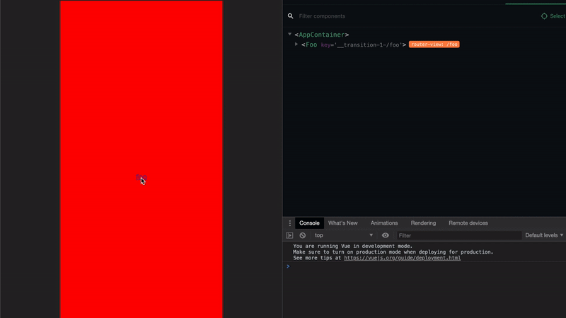

# Vue Stack Navigator

`vue-stack-navigaotr` is a stack navigator for Vue apps



## Navigation

- [Concept](#Concept)
- [Installation](#Installation)
- [Usage](#Usage)
- [Example](#Example)

## Concept

In the browser navigator model, when navigate from FooScreen to BarScreen, BarScreen created, FooScreen destroyed, when back to FooScreen, FooScreen created again, BarScreen destroyed, but in the App navigator model, FooScreen keep alived. VueStackNavigator bring this ability to you.

## Installation

**npm**

```bash
npm install vue-stack-navigator
```

## Usage

```js
import Vue from 'vue'
import VueRouter from 'vue-router'
import VueCompositionApi from '@vue/composition-api'
import VueStackNavigator, { AppContainer } from 'vue-stack-navigator'

Vue.use(VueCompositionApi)
Vue.use(VueStackNavigator)

const Foo = { template: '<div>foo</div>' }
const Bar = { template: '<div>bar</div>' }

const routes = [
  { path: '/foo', component: Foo },
  { path: '/bar', component: Bar }
]

const router = new VueRouter({
  routes // short for `routes: routes`
})

const app = new Vue({
  ...AppContainer,
  router
}).$mount('#app')
```

## Example

1. Clone this repo
2. Run `npm run build`
3. Open `./example/index.html` in your browser
